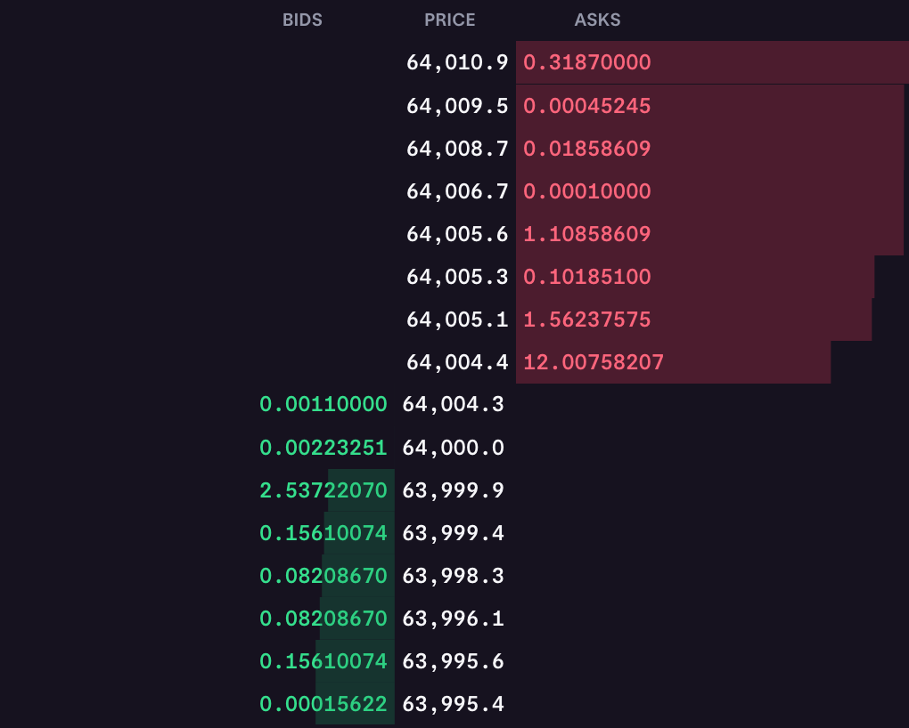

+++
title = "Developing a financial exchange in Go — Part 1"
description = "In this series of blog posts, I'm going to try to create a financial exchange from scratch in Go. For part 1, we talk about the core idea of a financial exchange, the order book, order matching and useful data structures for creating a matching engine."
date = 2024-07-20T12:46:15+02:00
lastmod = 2024-07-20T12:46:15+02:00
publishdate = 2024-07-20T12:46:15+02:00
tags = ["finance", "web"]
categories = ["development"]
newsletter_groups = ["Web dev", "Fintech & finance"]
draft = false
+++

In this series of blog posts, I'm going to try to create a financial exchange from scratch in Go. Why? Because 1) it's been a few years since I've written Go and I'd like to revisit the language and 2) the core idea of a financial exchange seems pretty trivial to me (matching buyers with sellers), but I know once I start making this a lot more will come to play than I thought.

So, how about we start with my idea of a financial exchange?


<ol>
	<li><a href="#a-financial-exchange">A financial exchange</a></li>
	<li><a href="#the-order-book">The order book</a></li>
	<li><a href="#order-matching">Order matching</a></li>
	<li><a href="#efficient-order-matching">Efficient order matching</a></li>
</ol>


## A financial exchange

When I say a financial exchange, I'm specifically thinking of a stock exchange. In theory, an "exchange" can be used for any type of good, whether it's shares, gold, food, currencies or anything that can be traded. But for the sake of simplicity, let's assume we're trading shares of stocks for the rest of the project.

On the one hand, you have **buyers**. Buyers create buy orders. For example, as a buyer, you may be willing to buy 100 shares of ASML for 50 EUR per share. Your goal as a buyer is often to be able to purchase your shares for the best price possible. Although, there may be some secondary goal(s) that are also interesting to think about: you probably also want your shares to be purchased as quickly as possible.

On the other hand, you have **sellers**. Sellers create sell orders. For example, as a seller, you might want to sell 100 shares of ASML for 60 EUR per share. Now, as a seller, you want to sell your shares for as much as possible. Again, there may be some secondary goals, but for the basic implementation of this project they aren't really important.

## The order book

Often, there will be a discrepancy between the sell and buy order. That's to say that the price of the seller will not match the price of the buyer. The lowest price a seller is offering is referred to as the **ask**, whereas the highest price a buyer is offering is reffered to as the **bid**.

However, sometimes the ask price will meet the bid price, at which point the seller and buyer get **matched** with each other and their orders get (partially) fulfilled.

I believe these concepts describe the core part of an exchange, the **order book**.

Order books can be visualised in some very fun ways.


In this "depth" chart from [Kjerish (Wikipedia)](part-1_order_book_depth_chart.gif), the x-axis represents the price, the y-axis represents the total number of shares being sold or purchased at that price, the green represents buy orders (bids) and the red represents sell orders (asks). You can see how the chart evolves through time.



Here's another visualisation in the "ladder" style from Kraken. You can see the price in the middle. The top half represents sell orders, the bottom half buy orders. The width of the green or red bar indiciates how the total quantity of shares for that price.

## Order matching

So the main value an exchange provides for buyers and sellers is that they can hopefully easily and quickly find someone that will be willing to fill their order. Imagine you're a seller walking around a room full of buyers asking each and every one of them if they would be willing to accept your price. It would 1) take a lot of time and 2) also require some bookkeeping. This is what the exchange's task should be, and it should be good at it.

Let's assume again we have a room of buyers or in code, an array of orders. This array is not structured or sorted in any way or form, we just add to it as buy orders come in.

```go
buyOrders = [...]Order{order1, order2, order3}
```

Now a sell order comes in. The seller wants to get the highest price for their order, i.e. the _bid_ price. Following the analogy of asking every buyer in the room what their price is, we would have to iterate over the orders in the `buyOrders` array to find the bid price. This would take `O(n)` with `n` the number of buy orders, thus it would not scale well.

## Efficient order matching

The behaviour we want is for an order to be _instantly_ matched, with a time complexity of `O(1)`. So, some kind of data structure that allows us to retrieve the order with the lowest price when _popping_ the list with `O(1)`. Note that popping entails the finding the order as well as removing it from the list. We could achieve this using a **sorted list**, where the first item would always be the order with the lowest price. Removing that item would also be `O(1)` which is important. Comparable data structures like the **priority queue** remove items in `O(log n)`, since the tree requires restructuring. However, inserting in a sorted list would be `O(n)` since it may require traversing the whole list. To summarise the comparison we're making:

| **Operation**  | **Sorted list** | **Priority queue** |
| -------------- | --------------- | ------------------ |
| Find min/max   | `O(1)`          | `O(1)`             |
| Remove min/max | `O(1)`          | `O(log n)`         |
| Insert         | `O(n)`          | `O(log n)`         |

We value find min/max and remove min/max both having `O(1)` time complexity more than the fact that the priority queue has `O(log n)` for insert instead of `O(n)`. The find min/max operation is important for the actual matching, but the remove min/max operation is also important since once the order has been fulfilled, it will have to be removed from the list. For this reason, I believe it is better to use the **sorted list** as the data structure for the buy and sell orders.

In the next part, we will attempt to create this order book and matching engine in Go.

